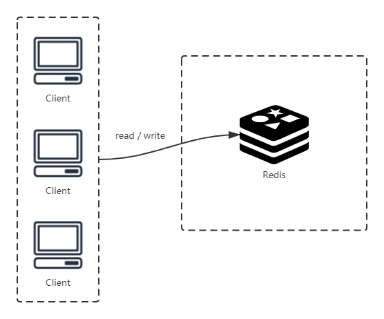
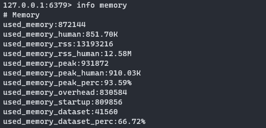
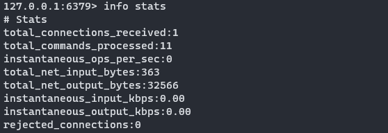

# **云原生Redis实践**

## **Redis与容器实践探索**

### **Redis云原生控制器设计**

#### **什么是云原生控制器**

**设计思想**

云原生控制器是控制器设计模式在云原生场景下的变种，即将云原生技术与控制器模式相结合，形成基于云原语指定的视图进行执行模式。

云原生控制器一般存在于对云基础设施资源或云上软件基础设施资源的控制管理的场景。控制器与基础设施模型建立Observe关系，通过视图对基础设施模型进行CRUD操作，触发控制器执行对应操作，完成对基础设施资源的处理。

 **K8S Operator**

K8S Operator SDK是目前使用最广泛的云原生控制器框架，采用controller-runtime框架，集成了K8S Informer，对监听到的Model（CRD）CRUD事件进行了缓存处理，以便控制器能够高效处理回调请求。

**通过K8S Operator实现统一云原生控制面**

云原生控制面的统一可以减轻API管理带来的技术负债，利用K8S APIServer的横向扩展能力，定义控制器对应的GVR（GroupVersionResource），将抽象基础设施模型合并为具象的业务视图，统一API原语，实现控制面的统一。

#### **业务控制面与业务数据面分离**

在实际应用场景中，我们会将控制器与生产业务进行分离设计，分离设计可以带来诸多优势：

- 可用域隔离，生产业务压力激增时，可以单独进行业务数据面维护，不会抢占控制器资源，导致控制器宕机。
- 业务数据面基础资源不受部署介质限制，业务数据面所需要的硬件资源与业务控制面差别较大，不建议混合。
- 在云上软件基础设施场景，业务数据面一般具备较强的弹性，控制器可以对底层平台进行水平伸缩（副本调节或容量扩缩，例如对IaaS层资源进行扩容，并触发K8S HPA），而不影响控制器本身高可用性。
- 业务控制面与业务数据面可独立升级，实现解耦式进化。

#### **通过Operator对云原生Redis实例进行业务层控制**
在Redis容器化部署场景下，使用Operator作为控制器对Redis生命周期以及业务控制进行管理，是比较合适的方案。

控制器在操作容器化Redis实例时，可以通过暴露的SVC地址或Operator通过监听业务数据面对应CR的变更，访问对应SVC或在对应的业务数据面运行对应的Job，来对Redis业务进行管理：

**Redis实例的生命周期管理**

Redis实例的生命周期包含实例的创建、删除、修改等过程，这些过程被设计为通过云原生控制器接管时，能够很大程度提升业务面的容错性，使状态机解耦。

当Redis创建事件进入Informer队列后，会随即被控制器取出，并创创建对应的K8S资源，并对应修改Redis CR Model的状态字段，完成生命周期管理。

**Redis业务控制**

业务控制通过在业务数据平面启动Job Pod的方式，非侵入式对Redis业务进行操作。

#### **多控制器**
采用K8S Operator作为云原生控制器，能够支持多控制器模式，我们可以通过在Operator中增加一组控制器对多个Model资源进行控制，实现Redis业务层面功能的扩展：

### **Redis云原生高可用架构模式**
高可用和可拓展是我们考量Redis的两个重要指标，其中高可用在Redis运行时中保障业务运行时的稳定性以及数据的稳定性提供了了至关重要的作用，下面，我们以Redis部署形态为维度，对云原生场景下Redis的高可用方案实现进行阐述。

K8S 是一个容器编排系统，可以自动化容器应用的部署、扩展和管理。K8S 提供了一些基础特性：

- 自动装箱
- 服务发现与负载均衡
- 自动化上线和回滚
- 水平扩缩容
- 存储编排
- 自我修复

Redis 云原生的目标，主要有以下几个：

- **资源的抽象和交付由 K8S 来完成，无需再关注具体机型。**在物理机时代我们需要根据不同机型上的 CPU 和内存配置来决定每个机型的机器上可以部署的 Redis 实例的数量。通过 Redis 云原生，我们只需要跟 K8s 声明需要的 CPU 和内存的大小，剩下的调度、资源供给、机器筛选由 K8s 来完成。
- **节点的调度由 K8S 来完成。**在实际部署一个 Redis 集群时，为了保证高可用，需要让 Redis 集群的一些组件满足一定的放置策略。要满足放置策略，在物理机时代需要运维系统负责完成机器的筛选以及计算的逻辑，这个逻辑相对比较复杂。K8s 本身提供了丰富的调度能力，可以轻松实现这些放置策略，从而降低运维系统的负担。
- **节点的管理和状态保持由 K8S 完成。**在物理机时代，如果某台物理机挂了，需要运维系统介入了解其上部署的服务和组件，然后在另外一些可用的机器节点上重新拉起新的节点，填补因为机器宕机而缺少的节点。如果由 K8s 来完成节点的管理和状态的保持，就可以降低运维系统的复杂度。
- **标准化 Redis 的部署和运维的模式。**尽量减少人工介入，提升运维自动化能力，这是最重要的一点。

#### **Redis 架构模式**

下面介绍一下云原生高可用支持的 Redis 架构模式。

##### **单机版Redis实例**

默认情况下，每台Redis服务器都是主节点。

单机版限制：

1. 内存容量有限 
1. 处理能力有限 
1. 无法高可用

##### **读写分离版Redis实例**

Redis 的复制（replication）功能允许用户根据一个 Redis 服务器来创建任意多个该服务器的复制品，其中被复制的服务器为主服务器（master），而通过复制创建出来的服务器复制品则为从服务器（slave）。

Master一般是用来做write，Slave一般是用来read。这样的结构可以有效的缓解系统的读写压力。

因为Master是负责write，那么就会出现主从数据的不同步，就需要通过sync，把Master的数据同步给Slave。

- 全量复制：slave刚接入，需要把master上的数据全部同步
- 增量复制：slave,网络中断,超时，导致部分数据需要增量同步

优点：

1. 支持主从复制，可以进行读写分离
1. 为了分载Master的读操作压力，Slave服务器可以为客户端提供只读操作的服务，写服务仍然必须由Master来完成
1. Slave同样可以接受其它Slaves的连接和同步请求，这样可以有效的分载Master的同步压力。
1. Master Server是以非阻塞的方式为Slaves提供服务。所以在Master-Slave同步期间，客户端仍然可以提交查询或修改请求。
1. Slave Server同样是以非阻塞的方式完成数据同步。在同步期间，如果有客户端提交查询请求，Redis则返回同步之前的数据

缺点：

1. Redis不具备自动容错和恢复功能，主机从机的宕机都会导致前端部分读写请求失败，需要等待机器重启或者手动切换前端的IP才能恢复。
1. 主机宕机，宕机前有部分数据未能及时同步到从机，切换IP后还会引入数据不一致的问题，降低了系统的可用性。
1. Redis较难支持在线扩容，在集群容量达到上限时在线扩容会变得很复杂。

##### **哨兵版Redis实例**

Redis Sentinel 是一个分布式系统中监控 Redis 主从服务器的监视器，并在主服务器下线时自动进行故障转移。其中三个特性：

- ​	监控（Monitoring）： Sentinel 会不断地检查你的主服务器和从服务器是否运作正常。
- ​	提醒（Notification）： 当被监控的某个 Redis 服务器出现问题时， Sentinel 可以通过 API 向管理员或者其他应用程序发送通知。
- ​	自动故障迁移（Automatic failover）： 当一个主服务器不能正常工作时， Sentinel 会开始一次自动故障迁移操作。

优点：

1. 保证高可用
1. 监控各个节点
1. 自动故障迁移

缺点：

1. 主从模式切换需要时间，会丢数据
1. 需要维护sentinel的信息，水平扩展很难处理
1. 没有解决 master 写的压力

##### **集群版Redis实例**

Redis 集群（Cluster）实例采用分布式架构，每个节点都采用一主一从的高可用架构，能够进行自动容灾切换和故障迁移。多种集群规格可适配不同的业务压力，可按需扩展数据库性能。每个数据分片均为双副本（分别部署在不同机器上）高可用架构，主节点发生故障后，系统会自动进行主备切换保证服务高可用。

Redis 集群是一个由多个节点组成的分布式服务器群，它具有复制、高可用和分片特性；Redi s集群没有中心节点，并且带有复制和故障转移特性，这可以避免单个节点成为性能瓶颈，或者因为某个节点下线而导致整个集群下线。

以下图所示的三主三从集群为例，每个主节点处理各自的数据，提供读写能力，从节点异步复制主节点的数据。

Redis集群 方案，采用的是虚拟槽分区，槽范围是0-16383，一共有16384个槽（Slots）。槽（Slots）是集群内数据管理和迁移的基本单位。比如上图的集群中有3个主节点，每个节点大致负责5500个槽的读写，节点会维护自身负责的虚拟槽。cluster集群中的主节点负责处理槽（存储数据），从节点则是主节点的复制品。

优点：

1. 能够提升Redis横向扩容能力
1. 数据分片存储，减少单个节请求压力
1. slave在master故障时，能够提升为master对外提供服务，提升集群整理可用性

缺点：

1. 对Client有一定要求，需要使用支持Move操作的smartClient，根据请求找到数据对应分槽节点
1. 需要为Client暴露所有节点的地址，使Client可以访问该节点分槽中的数据
1. 在节点达到一定规模（1000左右），由于分槽元数据同步会使得整个Redis性能大幅下降。

##### **代理模式版Redis实例**

在Redis的集群和读写分离架构中，代理服务器（Proxy）承担着路由转发、负载均衡与故障转移等职责。

代理服务器（Proxy）是Redis实例中的一个组件，不会占用数据分片的资源，通过多个Proxy节点实现负载均衡及故障转移。

优点：

1. 客户端（Jedis）直连有限的proxy节点，会比较轻量和简单
1. 集群规模理论上可以非常大，因为proxy对外隐藏了集群规模

缺点：

1. 多了一层proxy访问，性能会有影响
1. 需要第三方的proxy实现，集群水平扩容时proxy要想平滑动态更新集群配置，需要开发工具支持
1. 代理层对Redis访问请求进行了转发，其能够支持的请求命令相较于原生Redis存在一定限制（根据选用代理框架不同，限制的程度则不同）

目前比较流行的代理框架：

- **predixy**：高性能全特征redis代理，支持Redis Sentinel和Redis Cluster。
- **redis-cluster-proxy**：Redis官方推出的集群模式代理组件，能够代理集群模式下的Redis，但无法支持上游认证且在Redis商业化后，该项目已不再维护。
- **twemproxy**：快速、轻量级memcached和redis代理，Twitter推特公司开发，目前业界广泛采用的redis代理。
- **codis**：redis集群代理解决方案，豌豆荚公司开发，相对比较成熟。
- **envoy**：由Lyft推出并贡献给CNCF社区，目前已经成为CNCF毕业项目，作为service mash的sidecar，提供redis集群代理模式与多主代理模式。

###### **Envoy代理模型**

Evnoy提供了Redis多主的代理模式，通过Envoy，可以轻松将Client请求负载到后端多master上，并提供了多种负载模型，能够实现多写、单写、多写单写结合等方式负载。

Envoy作为Redis代理，同样能够支持集群模式，通过随机访问集群模式中的一个节点，通过CLUSTER SLOT命令获取到当前集群的分槽、节点信息，并缓存在Envoy的\_redis\_addresses对象中，在访问对应分槽数据时，对Client请求进行转发，能够解决集群模式需要对外暴露地址的问题，请求由Envoy进行拦截，并找对对应的数据分槽，进行转发，最后汇总到Client，并且支持AUTH命令的转发，在Envoy中同样可以为Redis设置上游Client认证密码与下游Redis集群认证密码，提供上下游加密模式，提升集群整体安全性。

###### **Codis代理模型**

Twemproxy是推特开源的，它最大的缺点就是无法平滑的扩缩容，而Codis解决了Twemproxy扩缩容的问题，而且兼容了Twemproxy。

Codis把所有的key分为1024个槽，每一个槽位都对应了一个分组，具体槽位的分配，可以进行自定义。首先要根据CRC32算法，针对Key算出32位的哈希值，除以1024取余，就能算出这个Key属于哪个槽，根据槽与分组的映射关系去对应的分组当中处理数据。CRC全称是循环冗余校验，主要在数据存储和通信领域保证数据正确性的校验手段。

但是codis proxy它本身也存在单点问题，所以需要对proxy做一个集群。Codis使用Zookeeper来保存映射关系，由proxy上来同步配置信息，它不止支持zookeeper，还有etcd和本地文件。

### **Redis在云原生下的可观测性**
可观测性（Observability）是指通过一个系统向外输出的信息了解其内部发生的事情的能力。Kubernetes 体系下的云原生应用天生就有着动态管理、频繁扩缩容的特性，我们通过监控告警、日志查询、事件记录等能力来保证 Redis 在云原生下的可观测性。

#### **监控告警**
作为伴随着 Kubernetes 共同成长并发展成熟的开源项目，Prometheus 已经成为了云原生场景下监控的事实标准。它有着高效、可拓展、易于集成、易于管理等优势，并且还拥有强大的数据模型和查询语言 PromQL。我们在 Redis 云原生实践中的监控功能也是结合 Prometheus 完成的，下面对其实现方案做相关介绍。

监控系统架构示意图

负责向 Prometheus 暴露监控指标数据的程序一般称之为 exporter ，它收集大部分 Redis的状态指标和性能指标，满足日常监控需求。

Redis 在诸如主从或是 Cluster 的集群模式下都会存在多个节点，为了保证可以收集到每个节点的监控指标，我们将 Redis Exporter 与 Redis 节点本身通过同一个 Pod 来部署。同一个 Redis 实例会创建出一个 Metrics Service 将收集的指标暴露出来，供 Prometheus 采集。

云原生场景下的 Prometheus 通常都会采用 Operator 模式来部署，借由此不但可以云原生的部署和管理诸多组件，还可以充分利用 Kubernetes 的诸如 ConfigMap，CRD（Custom Resource Definition）等能力来简化配置。

在传统部署模式下，Prometheus 的监控目标（Target）一般会通过 static\_config 的方式进行静态配置或是通过一个服务注册中心来完成。ServiceMonitor CRD 允许声明式地定义需要被监控的Target Service 的动态集合，它根据 Prometheus 的公开约定通过 Label 来筛选目标，然后通过这些约定自动发现新的目标而无需重新配置。

对于 Redis Exporter 暴露出的大量指标，我们需要根据自己的需要进行过滤和处理。一般取最关心的连接数、内存使用和 Key 数量等关键指标通过 PromQL 查询处理后供前端展示即可。

通过对于上述监控指标设置告警阈值指标，对接平台的告警中心（Alertmanager）即可实现告警功能。
#### **日志查询**
日志系统负责记录着应用运行过程中产生的日志，相较于监控，可以更为细致的展现程序的运行状态。在云原生场景下，容器中运行程序产生的日志一般都直接输出到stdout，由相应的日志采集器负责统一收集。

日志系统架构示意图

我们在云原生 Redis 中的日志主要分两部分：工作负载中应用程序产生的日志和Redis 本身的运行日志。如架构图所示，两者分别位于控制面与数据面，为了进行跨平面的统一日志查询，需要一些工具来帮助搭建日志查询系统。
##### **Fluentd 与 Fluent Bit**
Fluentd 也是从 CNCF 毕业的项目，凭借着高效灵活的特性在云原生时代逐渐替代了传统ELK（ElasticSearch，Logstash，Kibana）系统中日志采集器（Logstash）组件。在我们的架构中，它主要起到聚合器的作用，而具体到各个容器的的采集工作则由它的同源项目 Fluent Bit 来完成。

Fluent Bit 则是在 Fluentd 生态系统下诞生的一个更轻量的新项目，它占用资源更少，性能更高，也更适合作为云原生场景下的日志采集器。

完成日志采集之后，剩下的存储、分析、查询及展示工作则仍交给 Elasticsearch 和 Kibana 这对经典组合。
##### **Elasticsearch 与 Kibana**
Elasticsearch 是一个准实时的分布式存储、搜索、分析数据库引擎。相较传统数据库，它自带分词功能，对模糊查询的支持更为强大，非常适合用来存储日志信息。Kibana 则是与 Elasticsearch 协同的日志分析和可视化展示工具，包括数据分析和图表化展示等功能。

由于云原生架构下的日志极为分散，通过上述工具搭建的能将集群日志、应用日志、系统日志等进行统一采集管理的平台则显得尤为重要，同时也是保障系统可观测性的关键一环。
#### **事件记录**
事件记录分为两部分：用户的操作事件和系统的操作事件。前者负责记录用户的关键操作，包括操作人、时间、动作、级别和类型等信息。后者则负责记录 Redis 实例的一些状态变更。

事件记录可以很好地进行问题定位和追溯。通过对接告警中心，系统管理员还可以定义一些关键操作用短信、钉钉或者邮件的方式通知到相应人员，提高系统的管理能力。

### **Redis性能提升**

#### **Redis对象系统与数据结构分析**
Redis中有很多常见的数据结构，如简单动态字符串（SDS）、双端链表、字典、压缩列表、整数集合等等，但Redis并没有直接使用这些数据结构来实现键值对数据库，而是基于这些数据结构构建了一个对象系统。对象系统中包含了字符串对象、列表对象、哈希对象、集合对象和有序集合对象这五种类型，这五种类型也是我们在日常使用Redis数据库中直接操作的对象。

通过对象系统，Redis可以针对不同的使用场景为对象设置不同的数据结构实现，从而优化对象在不同场景下的使用效率。
##### **字符串**
Redis中用到最多的就是字符串的使用，作为一种常见的数据类型，Redis没有直接使用C语言传统的字符串表示，而是自己创建了一种动态字符串（SDS）。

优势（主要针对与C语言字符串的比较）：

- 常数复杂度获取字符串长度
  - 针对C字符串必须便利整个字符串才能获取长度。
- 杜绝缓冲区溢出
  - 针对要修改字符串内容时，当需要修改的长度大于已分配长度，并且没有重新分配空间，导致溢出。
  - SDS API在对SDS进行修改时，会自动将空间扩展至所需大小，不需要手动操作。
- 空间预分配：不仅为SDS分配修改所需要的空间，还会额外分配未使用的空间（基于当前修改的最大值  预期下次分配的结果，已使用和未使用free各占一半）
  - 惰性释放：SDS字符串缩短操作时不立即重新分配，而是使用free属性记录下来，等待将来使用。

`                              `
##### **有序集合**
有序集合类型 (Sorted Set或ZSet) 相比于集合类型多了一个排序属性 score（分值），对于有序集合 ZSet 来说，每个存储元素相当于有两个值组成的，一个是有序结合的元素值，一个是排序值。有序集合保留了集合不能有重复成员的特性(分值可以重复)，但不同的是，有序集合中 的元素可以排序。

有序集合的底层编码实现主要是跳跃表和压缩列表。使用压缩列表的判断条件**（**同时满足**）：**

- 有序集合的数量小于128个。
- 所有元素成员的长度都小于64字节。
##### **压缩列表**
当一个列表键之包含少量的列表项，并且列表项要么就是小数值，要么就是长度比较短的字符 串，那么Redis就会将压缩列表来作为列表键的底层实现。（压缩列表是列表键和哈希键的底层实现之一）

压缩列表存在的意义是为了节约内存，之所以说这种存储结构节省内存,是相较于数组的存储思路而言的。我们知道,数组要求每个元素的大小相同,如果我们要存储不同长度的字符串,那我们就需要用最大长度的字符串大小作为元素的大小(假设是20个字节)。存储小于 20 个字节长度的字符串的时候，便会浪费部分存储空间。

`	`数组的优势占用一片连续的空间可以很好的利用CPU缓存访问数据。如果我们想要保留这种优势，又想节省存储空间我们可以对数组进行压缩。

`	`但是这样有一个问题，我们在遍历它的时候由于不知道每个元素的大小是多少，因此也就无法计算出下一个节点的具体位置。这个时候我们可以给每个节点增加一个lenght的属性以此来记录前一个节点的具体位置。

`                            `
##### **跳跃表**
跳跃表是一种有序数据结构，通过在每个节点中维持多个指向其它节点的指针，从而达到快速访问节点的目的，作为Redis中有序集合键的底层实现之一。

跳跃表在链表的基础上增加了多级索引以提升查找的效率，但其是一个空间换时间的方案，必然会带来一个问题——索引是占内存的。原始链表中存储的有可能是很大的对象，而索引结点只需要存储关键值值和几个指针，并不需要存储对象，因此当节点本身比较大或者元素数量比较多的时候，其优势必然会被放大，而缺点则可以忽略。

`   `
##### **列表对象**
列表（list）类型是用来存储多个有序的字符串，列表中的每个字符串称为元素(element)，一个列表最多可以存储232-1个元素。在Redis中，可以对列表两端插入（push）和弹出（pop），还可以获取指定范围的元素列表、获取指定索引下标的元素等。列表是一种比较灵活的数据结构，它可以充当栈和队列的角色，在实际开发上有很多应用场景。有以下特点：

- 列表中的元素是有序的，可以通过索引下标获取某个元素或者某个范围内的元素列表。
- 列表中的元素可以是重复的。

当元素的个数（512）以及元素的值（64字节）时，使用压缩列表，否则则使用双端链表。

`           `
##### **哈希对象**
哈希类型的内部编码有两种：压缩列表和哈希表。只有当存储的数据量比较小的情况下，Redis 才使用压缩列表来实现字典类型。具体需要满足两个条件：

- 当哈希类型元素个数小于hash-max-ziplist-entries配置（默认512个）
- 所有值都小于hash-max-ziplist-value配置（默认64字节）

ziplist使用更加紧凑的结构实现多个元素的连续存储，所以在节省内存方面比hashtable更加优秀。当哈希类型无法满足ziplist的条件时，Redis会使用hashtable作为哈希的内部实现，因为此时ziplist的读写效率会下降，而hashtable的读写时间复杂度为O（1）。

`            `

##### **集合对象**
集合类型的内部编码有两种：

- intset(整数集合):当集合中的元素都是整数且元素个数小于set-maxintset-entries配置（默认512个）时，Redis会选用intset来作为集合的内部实现，从而减少内存的使用。
- hashtable(哈希表):当集合类型无法满足intset的条件时，Redis会使用hashtable作为集合的内部实现

`                     `
#### **Redis内存消耗与优化**
Redis是基于内存的数据库，内存占用过高会导致Redis响应变慢，甚至会引起数据丢失以及故障恢复变慢等问题。

Redis内存消耗主要在于其主进程消耗和子进程消耗。而主进程消耗又主要包括自身内存、对象内存、缓冲区内存、内存碎片五个方面。
##### **自身内存**
Redis自身内存指的是进程本身所占用的内存，通常可以忽略不计（一个空的Redis进程所消耗的内存几乎忽略不计）
##### **对象内存**
对象内存的占用主要是来源于五种常见数据结构（字符串、列表、哈希、集合、有序集合）的存储，不同的数据结构在不同的场景下使用不同的底层实现。因此在使用Redis的使用过程中需要根据场景选择合适的对象，从而避免内存溢出。

Redis的每一种对象都是key-value的键值对形式。每个键值对的创建都包含两个对象，key对象和value对象。因此对象内存的消耗可以理解为sizeof(key)+sizeof(value)。而key对象都是字符串类型的，在使用过程中我们不应该忽略key对象所占用的内存，应该避免使用过大的key。
##### **缓冲区内存**
Redis主要有三个缓冲区，客户端缓冲区、AOF缓冲区、复制积压缓冲区。

`        `

` `缓冲区的优势有两个：

- 缓和CPU和I/O设备速度不匹配
- 减少磁盘同一时间的读写速度

但是使用不当时也会带来很多问题，常见的问题就是超出内存限制导致内存溢出，如写的速度过快导致缓冲区内存需求增加、存入大数据等等。

客户端缓冲区是为了解决客户端和服务端请求和处理速度不匹配问题的，它又分为输入和输出缓冲区。输入缓冲区会先把客户端发送过来的命令暂存起来，Redis 主线程再从输入缓冲区中读取命令，进行处理。当在处理完数据后，会把结果写入到输出缓冲区，再通过输出缓冲区返回给客户端。

AOF缓冲区是AOF持久化时所用到的缓冲区，AOF缓冲区消耗的内存取决于AOF重写时间和写入命令量。

复制积压缓冲区则是在集群环境中为了保证主从节点数据同步的所设置的。主节点在向从节点传输 RDB 文件的同时，会继续接收客户端发送的写命令请求。这些写命令就会先保存在复制缓冲区中，等 RDB 文件传输完成后，再发送给从节点去执行。主节点上会为每个从节点都维护一个复制缓冲区，来保证主从节点间的数据同步。

##### **内存碎片**
内存碎片主要是由于操作系统的内存分配机制和Redis内存分配器的分配策略所决定的。内存分配器为了更好地管理和重复利用内存， 分配内存策略一般采用固定范围的内存块进行分配。例如当保存5KB对象时内存分配器可能会采用8KB的块存储， 而剩下的3KB空间变为了内存碎片不能再分配给其他对象存储。
###### **子进程内存消耗**
子进程内存消耗主要指执行AOF/RDB重写时Redis创建的子进程内存消耗。Redis持久化在执行RDB快照和AOF重写时主进程会fork出一个子进程，由子进程完成快照和重写操作，虽然使用了写时复制的技术，子进程可以不用完全复制父进程的所有物理内存，但是仍然需要复制其内存页表，在此期间如果有写入操作则需要复制出一份副本出来。因此子进程同样会消耗一部分内存，其消耗的内存量取决于RDB和AOF期间的写入命令量。在执行RDB和AOF重写的时候为了防止内存溢出，会预留一部分内存。
#### **Redis性能进行诊断分析与优化**
Redis采用单线程模型，当执行某个命令耗时较长时会影响其它命令的执行效率。因此，虽然Redis是一个高性能低时延的缓存服务，但是如果在耗时较长的任务发生时，任然会有性能问题出现。
##### **内存诊断与优化**
###### **内存交换引起的性能问题**
内存使用率是Redis服务在使用过程中十分重要的一个性能指标，如果Redis实例的内存使用率超过最大可用内存，那么操作系统会将内存与Swap空间交换，把内存中旧的或不再使用的内容写入硬盘上的Swap分区，以便留出新的物理内存给新页或活动页（page）使用。

通常我们可以在客户端使用“info memory”查看Redis服务使用的内存情况，其中“used\_memery”表示Redis服务已使用的内存，当“used\_memory”>最大可用内存时，Redis实例正在进行内存交换或者已经内存交换完毕。如果Redis进程上发生内存交换，那么Redis及使用Redis数据的应用性能都会受到严重影响。

在硬盘上进行读写操作要比在内存上进行读写操作，时间上慢了近5个数量级，内存是0.1μs单位、而硬盘是10ms。如果Redis进程上发生内存交换，那么Redis和依赖Redis上数据的应用会受到严重的性能影响。 通过查看used\_memory指标可知道Redis正在使用的内存情况，如果used\_memory>可用最大内存，那就说明Redis实例正在进行内存交换或者已经内存交换完毕。管理员根据这个情况，执行相对应的应急措施。
###### **跟踪内存使用率**
如果在使用Redis期间没有使用持久化策略，那么缓存数据在Redis崩溃时就有丢失的危险。因为当Redis内存使用率超过可用内存的95%时，部分数据开始在内存与swap空间来回交换，这时就可能有丢失数据的危险。

当开启并触发快照功能时，Redis会fork一个子进程把当前内存中的数据完全复制一份写入到硬盘上。因此若是当前使用内存超过可用内存的45%时触发快照功能，那么此时进行的内存交换会变的非常危险(可能会丢失数据)。 倘若在这个时候实例上有大量频繁的更新操作，问题会变得更加严重。

通过减少Redis的内存占用率，来避免这样的问题，或者使用下面的技巧来避免内存交换发生：

- 对于缓存数据小于4GB，可选择采用32位的Redis实例，达到较少内存的占用空间效果。
- 尽可能的使用Hash数据结构。因为Redis在储存小于100个字段的Hash结构上，其存储效率是非常高的。
- 设置key的过期时间，Redis会在key过期时自动删除key。
- 回收key。在Redis配置文件中(Redis.conf)，通过设置“maxmemory”属性的值可以限制Redis最大使用的内存，修改后重启实例生效。
##### **延迟诊断与优化**
在Redis实例中，[可以通过]()跟踪命令处理总数[（total_commands_processed）来判断延迟问题所在]()，因为Redis是个单线程模型，客户端过来的命令是按照顺序执行的。比较常见的延迟是带宽，通过千兆网卡的延迟大约有200μs。倘若明显看到命令的响应时间变慢，延迟高于200μs，那可能是Redis命令队列里等待处理的命令数量比较多。 如上所述，延迟时间增加导致响应时间变慢可能是由于一个或多个慢命令引起的，这时可以看到每秒命令处理数在明显下降，甚至于后面的命令完全被阻塞，导致Redis性能降低。要分析解决这个性能问题，需要跟踪命令处理数的数量和延迟时间。

当客户端明显发现响应时间过慢时，可以通过记录的total\_commands\_processed历史数据值来判断命理处理总数是上升趋势还是下降趋势，以便排查问题。
##### **跟踪Redis延迟性能**
Redis之所以这么流行的主要原因之一就是低延迟特性带来的高性能，所以说解决延迟问题是提高Redis性能最直接的办法。拿1G带宽来说，若是延迟时间远高于200μs，那明显是出现了性能问题。 虽然在服务器上会有一些慢的IO操作，但Redis是单核接受所有客户端的请求，所有请求是按良好的顺序排队执行。因此若是一个客户端发过来的命令是个慢操作，那么其他所有请求必须等待它完成后才能继续执行。

可以通过一下几个方法分析延迟性能问题：

- 使用slowlog查看引发延迟的慢命令
- 监控客户端的连接
- 限制客户端的连接数
- 加强内存管理
##### **内存碎片诊断与优化**
内存碎片率同样是影响Redis服务的重要性能指标之一。内存碎片率（mem\_fragmenttation\_ratio）稍大于1是合理的，这个值表示内存碎片率比较低，也说明redis没有发生内存交换。但如果内存碎片率超过1.5，那就说明Redis消耗了实际需要物理内存的150%，其中50%是内存碎片率。若是内存碎片率低于1的话，说明Redis内存分配超出了物理内存，操作系统正在进行内存交换。

内存碎片的优化方法：

- 重启Redis服务器，将额外产生的内存碎片失效并重新作为新内存使用。
- 限制内存交换，增加可用物理内存或减少实Redis内存占用。
- 修改内存分配器。

针对Redis相关的性能优化，首先可以根据业务需要选择合适的数据类型，并为不同的应用场景设置相应的紧凑存储参数。其次如果不需要进行数据持久化，可以关闭以提高处理性能和内存使用率。最后需要控制实际内存的使用率以及客户端的连接数。

